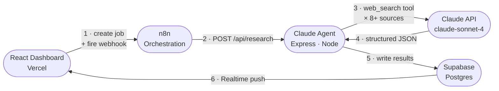

# Competitive Intel

An AI-powered competitive intelligence agent that automatically researches any competitor and delivers structured sales enablement outputs — no manual research required.

---

## Why I Built This

Sales and strategy teams waste hours every week hunting for competitor information that's scattered across review sites, pricing pages, and news articles — and it goes stale the moment they finish. I built this to automate that entire workflow: type a competitor name, get a complete battle card in minutes, always based on current web data.

---

## How It Works

```
1. Enter a competitor name in the dashboard
        ↓
2. Frontend creates a job in Supabase and fires an n8n webhook
        ↓
3. n8n triggers the Claude agent with the competitor name and job ID
        ↓
4. Claude agent runs web searches across 8+ sources
   (homepage, pricing, G2/Capterra, news, LinkedIn, Reddit, SEC filings)
        ↓
5. Claude synthesizes findings into structured JSON
        ↓
6. Agent writes results to Supabase
        ↓
7. React dashboard updates in real time via Supabase Realtime — no refresh needed
```

---

## Architecture



> **ASCII fallback** (if Mermaid doesn't render):
>
> ```
> [React / Vercel] → fires webhook → [n8n] → POST → [Claude Agent / Express]
>        ↑                                                      ↓
>        └──── Supabase Realtime ←── [Supabase Postgres] ←─────┘
>                                          ↑
>                                  Claude API (web search)
> ```

---

## What the Agent Produces

Each research run generates four structured outputs, displayed in a live dashboard:

| Output | What it contains |
|---|---|
| **Battle Cards** | Competitor positioning, pricing tiers, strengths/weaknesses with deal tips, objection-handling talk tracks, and "landmines" to avoid on competitive calls |
| **Competitive Triggers** | Timestamped events — funding rounds, product launches, pricing changes, key hires, and negative press — that signal when to reach out |
| **Head-to-Head Matrix** | Feature-by-feature comparison table with an advantage rating (Us / Them / Neutral) and a ready-to-use talking point for each row |
| **Related Competitors** | Three automatically surfaced alternatives — closest substitutes and emerging threats — each with a one-line summary |

All outputs include source attribution (URLs) so every claim is traceable.

---

## Tech Stack

| Layer | Technology | Purpose |
|---|---|---|
| **Frontend** | React 19 + Tailwind CSS v3 | Dashboard UI, deployed on Vercel |
| **Orchestration** | n8n | Webhook-triggered workflow that hands off jobs to the agent |
| **AI Agent** | Claude API (`claude-sonnet-4-20250514`) | Agentic web research + structured output generation |
| **Web Search** | Anthropic `web_search_20250305` tool | Real-time web crawling during agent runs |
| **Agent Server** | Express.js (Node) | HTTP server that receives jobs and runs the Claude agentic loop |
| **Database** | Supabase (Postgres) | Stores competitors, jobs, and research outputs |
| **Realtime** | Supabase Realtime | Pushes job status and output updates to the UI without polling |

---

## Getting Started

### Prerequisites

- Node.js 18+
- A [Supabase](https://supabase.com) project with the schema below applied
- An [Anthropic API key](https://console.anthropic.com) with `web_search` tool access
- An [n8n](https://n8n.io) instance (cloud or self-hosted)

### 1. Clone the repo

```bash
git clone https://github.com/alinaeast/competitive-intel.git
cd competitive-intel
```

### 2. Configure environment variables

Copy `.env.example` to `.env` in the project root and fill in your credentials:

```bash
cp .env.example .env
```

```env
# Anthropic
ANTHROPIC_API_KEY=sk-ant-...

# Supabase
SUPABASE_URL=https://your-project.supabase.co
SUPABASE_ANON_KEY=eyJ...

# n8n
N8N_WEBHOOK_URL=https://your-n8n-instance.com/webhook/...
```

The frontend (`frontend/.env`) needs the Supabase keys and n8n webhook URL as `REACT_APP_` prefixed variables — see `frontend/.env.example`.

### 3. Apply the database schema

Run `supabase_schema.sql` in your Supabase SQL editor. This creates the `competitors`, `research_jobs`, `research_outputs`, and `config` tables, and enables Realtime on all four.

### 4. Start the agent server

```bash
cd agent
npm install
npm run dev        # starts on port 3001, auto-restarts on file changes
```

### 5. Start the frontend

```bash
cd frontend
npm install
npm start          # starts on port 3000
```

### 6. Import the n8n workflow

Import `n8n_workflow.json` into your n8n instance. Update the HTTP Request node URL to point at your agent server (`http://localhost:3001/api/research` for local dev).

### 7. Deploy the frontend

Connect the repo to [Vercel](https://vercel.com). Set the **Root Directory** to `frontend/` and add the `REACT_APP_*` environment variables in the Vercel dashboard.

---

## Project Structure

```
competitive-intel/
├── agent/
│   ├── index.js              # Express server + Claude agentic loop
│   └── package.json
├── frontend/
│   ├── public/
│   └── src/
│       ├── App.js            # Root state, Supabase Realtime subscriptions
│       ├── supabase.js       # Supabase client initialisation
│       └── components/
│           ├── Sidebar.js          # Competitor list + job status
│           ├── MainPanel.js        # Tab container + status header
│           ├── NewResearchModal.js # Multi-competitor research queue modal
│           ├── SettingsModal.js    # "My Product" config (informs Claude prompts)
│           └── tabs/
│               ├── BattleCard.js          # Positioning, pricing, S/W, objections
│               ├── CompetitiveTriggers.js # Funding, launches, news events
│               └── HeadToHead.js          # Feature matrix + related competitors
├── n8n_workflow.json         # Importable n8n workflow definition
├── supabase_schema.sql       # Full database schema + Realtime config
└── .env.example              # Environment variable template
```

---

## Key Design Decisions

**Agentic loop, not a single prompt** — The agent runs Claude in a loop, allowing it to call `web_search` as many times as needed before producing output. This means it follows links, cross-references sources, and builds context iteratively — the same way a human analyst would.

**Structured JSON output with retry** — Claude is prompted to return a strict JSON schema. If the response can't be parsed (e.g. Claude adds a preamble), the agent automatically sends a correction prompt and retries once before marking the job as failed.

**Supabase Realtime over polling** — Job status and research output updates are pushed to the frontend the moment the database changes. No refresh, no polling loop.

**Source attribution throughout** — Every claim in the output includes a `source_label` and `source_url` traced back to where Claude found the information, so sales reps can verify or dig deeper.

---

*Built with the [Claude API](https://anthropic.com) · [Supabase](https://supabase.com) · [n8n](https://n8n.io) · [Vercel](https://vercel.com)*
